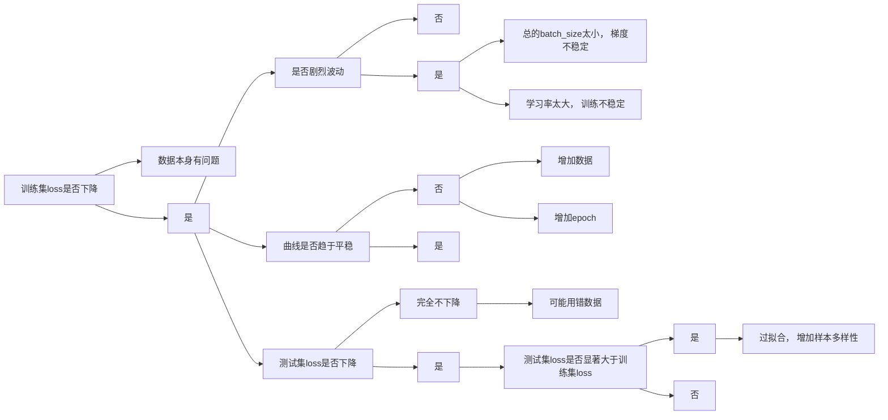

```mermaid
graph LR
	A[训练集loss是否下降] --> A1[数据本身有问题]
	
	A --> A2[是]
	A2 --> A21[是否剧烈波动]
	A21 --> A211[否]
	A21 --> A212[是]
	A212 --> A2121[总的batch_size太小， 梯度不稳定]
	A212 --> A2122[学习率太大， 训练不稳定]
	
	A2 --> A22[曲线是否趋于平稳]
	A22 --> A221[否]
	A221 --> A2211[增加数据]
	A221 --> A2212[增加epoch]
	A22 --> A222[是]
	
	A2 --> A23[测试集loss是否下降]
	A23 --> A231[完全不下降]
	A231 --> A2311[可能用错数据]
	A23 --> A232[是]
	A232 --> A2321[测试集loss是否显著大于训练集loss]
	A2321 --> A23211[是] --> A232111[过拟合， 增加样本多样性]
	A2321 --> A23212[否]
	
	
```

